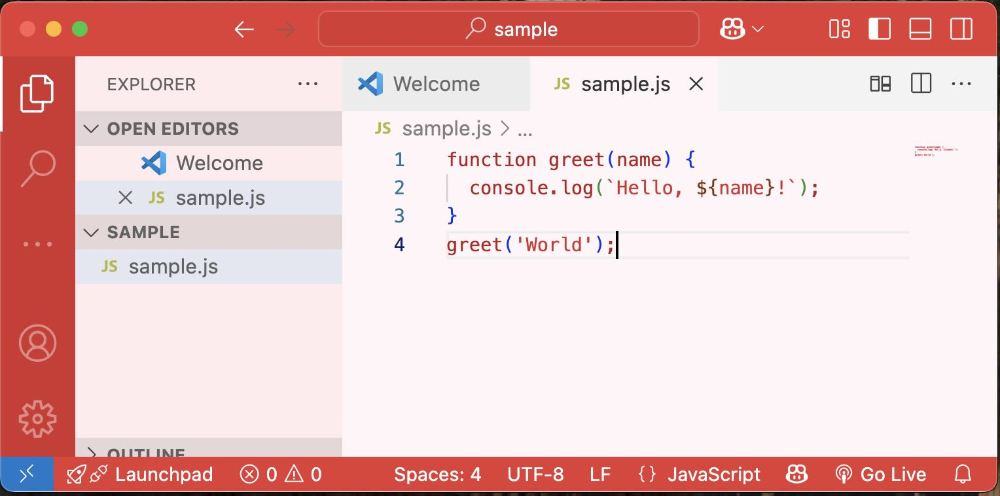
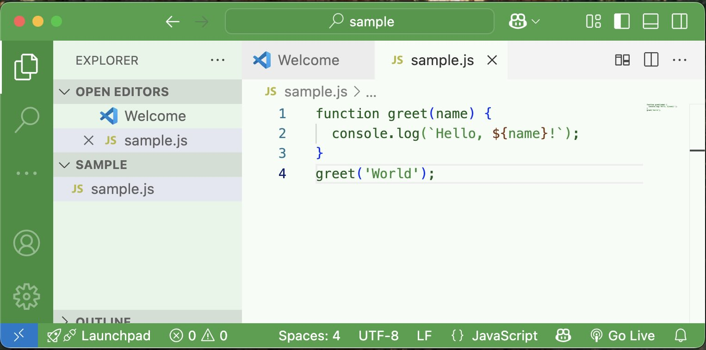

# Happy Themes for Visual Studio Code ( VSCode)

Looking for bright happy themes for your VSCode IDE? You found them!

## Installation Instructions

In VSCode open a terminal and follow the instructions below.

### How to Install All Themes At Once

You can install all the themes at once by running this script from a VSCode terminal.

```
./install-all.sh
```

Or you can install themes one at a time.

### How to Install Themes One at a Time

Pick the themes you want and install just those.

#### Happy Yellow


1. Execute these terminal commands
```bash
> cd happy-yellow
> code --install-extension happy-yellow-1.0.0.vsix
```
2. Apply the theme
```
In VS Code, open the Command Palette (Cmd+Shift+P), type Color Theme, and select Happy Yellow.
```

#### Happy Blue


1. Execute these terminal commands
```bash
> cd happy-blue
> code --install-extension happy-blue-1.0.0.vsix
```
2. Apply the theme
```
In VS Code, open the Command Palette (Cmd+Shift+P), type Color Theme, and select Happy Blue.
```

#### Happy Red



1. Execute these terminal commands
```bash
> cd happy-red
> code --install-extension happy-red-1.0.0.vsix
```
2. Apply the theme
```
In VS Code, open the Command Palette (Cmd+Shift+P), type Color Theme, and select Happy Red.
```

#### Happy Green



1. Execute these terminal commands
```bash
> cd happy-green
> code --install-extension happy-green-1.0.0.vsix
```
2. Apply the theme
```
In VS Code, open the Command Palette (Cmd+Shift+P), type Color Theme, and select Happy Green.
```

---

Happy themes are free for everyone to use. Enjoy!