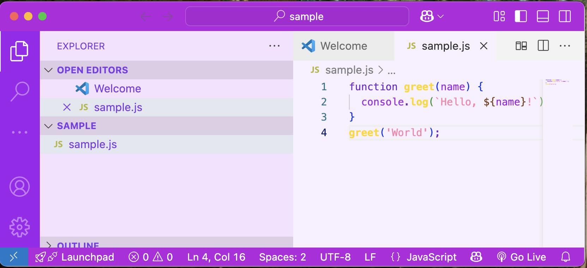

# Happy Themes for Visual Studio Code

Bright, cheerful color themes for your VS Code IDE!  
Install one extension and get all the Happy themes: Yellow, Blue, Red, Green, and Purple.

## How to Use

1. Install Happy Themes from the VSCODE Marketplace. It is a free VSCODE extension.

2. Open the Command Palette 
    - MacOS: `Cmd+Shift+P`
    - WindowsOS: `Ctrl+Shift+P`).

3. Type `Color Theme` and select **Preferences: Color Theme**.

4. Choose any Happy theme and you are on your way!
  
   - Happy Yellow  
   - Happy Blue  
   - Happy Red  
   - Happy Green 
   - Happy Purple 

## Theme Samples

### Happy Yellow

### Happy Blue

### Happy Red

### Happy Green

### Happy Purple

---

Happy Themes are free for everyone to use. Enjoy! Be happy!